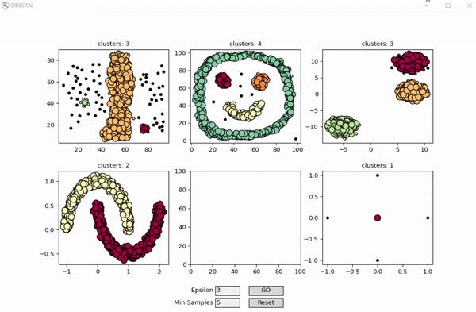

# DBSCAN Clustering

Interactive DBSCAN (Density Based Spatial Clustering of Applications with Noise) Clustering.

* New points can be drawn on bottom-middle sub-plot by mouse clicks.
* Epsilon and Min Sample parameters in the window are just for the interactive sub-plot. paremeters for other sub-plots are hardcoded in the main function.
* `interactive_dataset_generator.py` script can be used to create custom 2D dataset.

## Installation

Clone the project and Install it in Virtual Environment:
```
git clone https://github.com/AsaadMe/DBSCAN
cd DBSCAN
python -m venv venv
venv\Scripts\activate (on Windows)
source venv/bin/activate (on Linux)
pip install -r requirements.txt
```

## Example

